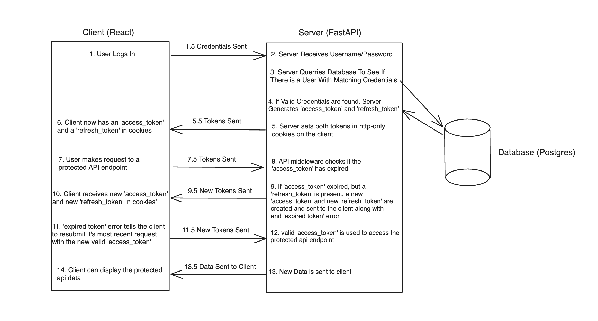

# JWT_Auth
<div align="center">
  <div style="display: inline-block; text-align: left;">
  
  
  
  
  
  
  <br>
  </div>
  
  <div style="display: inline-block; text-align: left;">
  
  
  
  
  
  </div>
</div>


<br>
This repository is intended to provide individuals with a starting point for building personal projects and to help with learning. 

<!-- TABLE OF CONTENTS -->
<details open>
  <summary>Table of Contents</summary>
  <ol>
    <li>
      <a href="#application-features">Application Features</a>
    </li>
    <li>
      <a href="#tech-stack">Tech Stack</a>
    </li>
    <li><a href="#how-to-get-started">How To Get Started</a></li>
    <li><a href="#using-pg-admin">Using PG Admin</a></li>
    <li><a href="#database-management">Database Management</a></li>
    <li><a href="#authentication">Authentication</a></li>
    <li><a href="#upcoming-features">Upcoming Features</a></li>
  </ol>
</details>

# Application Features
- Full Stack Application
- Frontend Web Client
- API Server
- Persistent Database
- Authentication
- JWT Based Access Tokens and Refresh Tokens
- Examples of Protected/Unprotected API Endpoints
- Automated API Calls
- Dockerized Environment
- 3rd Party Database Management Tool
- Database Migration Tool
- SQL ORM

# Tech Stack
- Server: FastAPI 
- Database: PostgreSQL 
- Object Relational Mapper: SQL Alchemy
- Database Migration Tool: Alembic
- Frontend Framework: React
- State Management Library: Redux Toolkit
- CSS Framework: Tailwind
- Containerization Tools: Docker & Docker-Compose

# How To Get Started
### Starting The Application
- Fork this repository
- clone your fork
- cd `/path/to/your-fork`
- create a `.env` file in `/path/to/your-fork`
- Add the following to your `.env` file:
```
POSTGRES_USER=username
POSTGRES_PASSWORD=password
POSTGRES_DB=postgres
PGADMIN_DEFAULT_EMAIL=user@email.com
PGADMIN_DEFAULT_PASSWORD=password
ACCESS_TOKEN_EXPIRE_MINUTES=1
REFRESH_TOKEN_EXPIRE_MINUTES=1440
```
- `docker volume create postgres_data`
- `docker-compose up`
##### IMPORTANT
- You should NEVER expose your `.env` varialbes on a public repo
- Create a `.gitignore` file in `/path/to/your-fork` and add `.env` to that file
- I have generic environment variables posted here to get you started
- Feel free to change them to whatever you like, but keep in mind that this will change the login credentials required for PG Admin and Database Access

### Accessing The Application
- React Client is at 'http://localhost:5173'
- FastAPI Server is at 'http://localhost:8000'
- PG Admin GUI is at 'http://localhost:5050'

# Using PG Admin

### What is PG Admin?
- PG Admin is not a required component of the full-stack application.
- PG Admin, as its name might suggest, is an administrator tool to help you manage your Postgres Database.
- It can be used to modify tables, data, and understand what is going on in your database.

### Connecting To Database
- Navigate to 'http://localhost:5050/'
- email: `user@email.com`
- password: `password`
- Once signed on, right click on server, and select register server
- In the `General` tab, give the server any name you want. `test_database` is a good one :)
- In the `Connection` tab, enter the following:
- Host name/address: `db`
- Port: `5432`
- Maintenance Database: `Postgres`
- Username: `username`
- Password: `password`
- Optional: check save password so you don't have to log into the database again whenever you log onto PG Admin

### Interacting With Database
- Left click on `test_database` (or whatever you called it) arrow
- Left click on `Databases` arrow
- Left click on `postgres` arrow
- Left click on `schemas` arrow
- Left click on `tables` arrow
- Now you can interact with you database tables

# Database Management
### Background
- PG Admin is a great tool for interacting with your database and understanding your schemas and queries!
- PG Admin is a great tool for adding/deleting data to/from existing tables in your database for the purposes of testing!
- It is not recommended to use PG Admin to add/remove tables from your database.
- It is not recommended to use PG Admin to modify the columns for the tables in your database.
- This is because the section of Docker-Compose that is responsible for starting the API is also responsible for migrating all migration files you create with Alembic to your Postgres database.
- In essence, Docker-Compose will look for all the changes you've made to your schemas in `/JWT_Auth/alembic/versions/`.
- It will find those changes and apply them to your postgres database when you run `docker compose up`
- If you only make changes your database tables' schemas using PG Admin, those changes will not persist when you stop and restart your containers.
- SQL Alchemy and Alembic are used to manage changes to the database and migrations.
### Great! So How Do I Actually Make Changes to The Tables in My Database?
  1. Make a Change to `JWT_Auth/app/models.py` (If you're familiar with Django, it's just like changing models.py - You just have to follow SQL Alchemy's syntax instead)
  2. These changes will be picked up and recognized by SQL Alchemy
  3. Run `docker-compose run api alembic revision --autogenerate -m "Your Message Here"`
  4. Run `docker-compose run api alembic upgrade head`

# Authentication
- Authentication is established through JWT tokens that are stored as HTTP-Only cookies on the client
- Access Tokens and Refresh Tokens are used to provide a positive user experience that doesn't require users to continuously submit their login credentials in order to stay authenticated.
- Default expiration time of Access Tokens is 1 minute
- Default expiration time of Refresh Tokens is 24 hours
- These values can be changed in the `.env` file
- As long as the user visits the website before the Refresh Token expires, they will never be signed out


# Upcoming Features
- [ ] Correct TypeScript Syntax (I don't know TypeScript at the moment, but adding it didn't break anything 😅). I have to go back into `tsconfig.json` and change `"include": ["src/**/*.ts"]` to  `"include": ["src"]`
- [ ] More Thorough Documentation
